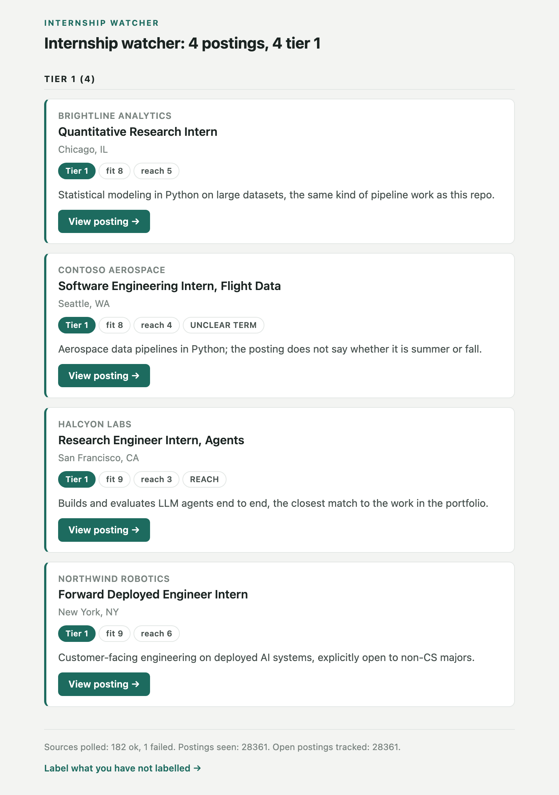

# internship-search

An agent that runs my internship search. Four times a day it polls 180 company job boards and
three aggregator feeds, works out what is new and what has closed, filters out what I cannot
apply to, and scores the rest against a written rubric with Claude. Since August 7, 2026 it has
completed 231 runs unattended and tracked 41,980 postings. Its rules filter cuts the 28,361
open ones to 2,646 (9.3%), and Claude has scored 3,197 of those. Total model spend to date is
$11.98, under half a cent per scored posting including tagging, and $3.80 in September, its
first full month.



## The pipeline

```
180 boards (Greenhouse, Lever, Ashby, Workday) + 3 aggregator feeds
        │  poll 4x a day, identify each posting by its requisition id
        ▼
SQLite: every posting ever seen, new and closed detected by diff
        │
        ▼
Pass 1  rules filter, all data in sources/prefilter.toml       free
Pass 2  intake tagging: term and weekly hours                  Claude Haiku 4.5, once per posting
Pass 3  timing rules on the tagged term                        free
        │  9.3% of open postings survive
        ▼
Stage B  score fit and reach 1 to 10 against rubric.md         Claude Haiku 4.5, every survivor
Stage C  re-score the promising ones                           Claude Sonnet 5, above a routing threshold
        │  deterministic tier caps applied after the model answers
        ▼
daily digest (tier 1), Sunday roundup, urgent alerts, Airtable base, dashboard
```

## Design decisions

Rules are data, not code. Every company, ATS token, filter rule and scoring criterion lives in
`sources/` or `rubric.md`. There is no company, city, job title or term name in the Python, and
changing how ranking behaves never needs a code change.

The filter flags instead of dropping. A posting wrongly dropped is invisible, and a posting
wrongly kept costs a few seconds of reading. So anything the rules cannot resolve surfaces with
a flag (UNCLEAR TERM, UNCLEAR LOCATION) rather than dying, and `tools.prefilter_report --samples`
prints real postings each rule killed so a bad rule becomes visible.

Two models, routed by the cheap one's answer. Haiku scores everything. Only postings whose
Haiku score clears a threshold in `rubric.md` go to Sonnet, whose answer replaces it; 957 of
the 3,197 scored postings went that far. The threshold is the cost dial. My 54 labelled
postings go into every scoring prompt as few-shot examples, which teaches the ranker my taste
and also pushed the prompt past Haiku's 4,096-token caching minimum, so cached calls read it at
a tenth of the input price.

Fit and reach are separate scales. Fit is how much I would want the role. Reach is how likely I
am to get it. A role at the most selective lab is fit 10, reach 2, and averaging the two would
hide both facts. Each scale has band-by-band anchors so the model does not answer 6 or 7 for
everything, and every batch re-scores 10% of its postings a second time and flags the digest
if the scores moved by more than a point on average.

Model scores are bounded by code. A tier cap in `rubric.md` holds non-AI roles at vehicle and
robotics employers to tier 2, applied after the model answers so its own score is still stored.
A score I set by hand in Airtable always beats the model's, and both are kept.

Postings are identified by requisition id, never by title. A recruiter editing a title would
otherwise close a live job and create a new one, leaving my labels behind on the dead row. A
content fingerprint is the fallback only when a board issues no id.

Spending is capped four ways. Hard exclusions run before any model call, each run caps tagging
at 400 calls and ranking at 150, and a $10 monthly budget in `rubric.md` pauses ranking when it
is used up. Anything over a cap waits for the next run rather than being lost. Every run
records its call count and estimated cost.

## Reliability

- `agent/health.py` emails on a failed run, on a run that reached almost no sources, on a long
  silence between runs, and on recovery. It shares no dependency with the database it
  monitors, and its 22 test cases were checked by mutation testing.
- A run is judged by how many sources answered, not by its exit code, so a run that reaches
  nothing and exits cleanly still raises an alert.
- launchd instead of cron, so a run scheduled while the laptop is asleep happens on wake
  instead of being skipped.
- A board that fails or returns nothing for three days is named at the top of the digest, which
  is how a company that moved to a different ATS shows up.
- Airtable's free plan meters 1,000 API calls a month. The sync skips rows that already match,
  runs once a day, and prints what it spent.

## Code

    agent/run.py            one polling cycle, the entry point
    agent/fetchers.py       Greenhouse, Lever, Ashby and Workday clients
    agent/feeds.py          aggregator feeds
    agent/db.py             SQLite schema, identity, new and closed detection
    agent/prefilter.py      applies sources/prefilter.toml
    agent/tagger.py         intake tagging, one Haiku call per posting
    agent/ranker.py         Stage B and Stage C scoring against rubric.md
    agent/delivery.py       which email a posting belongs in, and when
    agent/notify.py         the digest, roundup and urgent emails
    agent/health.py         failure and silence alerts
    agent/airtable_sync.py  postings out, my labels back in
    agent/dashboard.py      what to do next, ranked by urgency
    rubric.md               the scoring rubric, read at runtime
    sources/                companies, feeds, filter rules, schedule, email policy
    tools/                  reports, maintenance commands and the test suites

Twelve test suites, 533 checks, all passing:

    for t in tools/test_*.py; do python -m tools.$(basename $t .py); done

## Running it

    python3 -m venv .venv && .venv/bin/pip install -r requirements.txt
    .venv/bin/python -m agent.run --no-email          # poll, filter, print the digest
    .venv/bin/python -m tools.rank_report             # what ranking would cost, no model calls
    .venv/bin/python -m tools.schedule --install      # run it four times a day under launchd

Scoring needs `ANTHROPIC_API_KEY`. Email and Airtable are optional, and a missing credential
skips that step rather than stopping the run.

Python, SQLite, Claude API (Haiku 4.5, Sonnet 5), Airtable API, launchd.

This is a sanitized copy. Personal details, application history and planning documents are left
out, and the code is unchanged.
