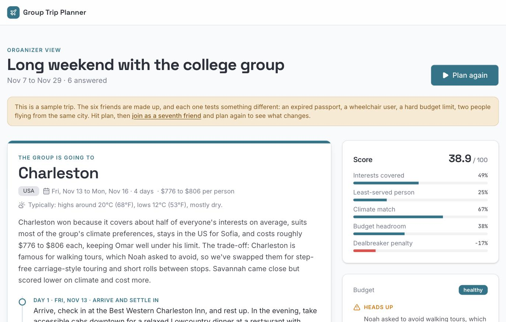
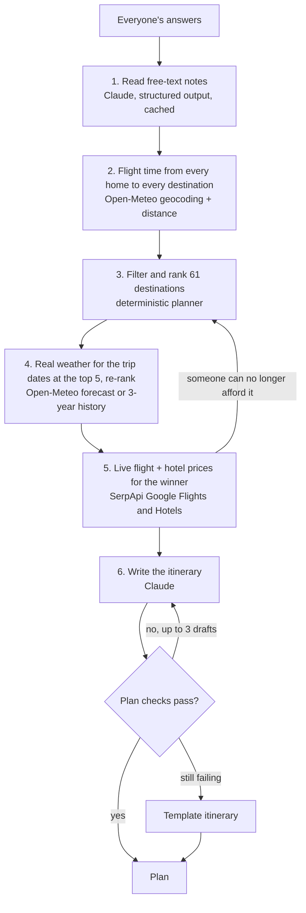
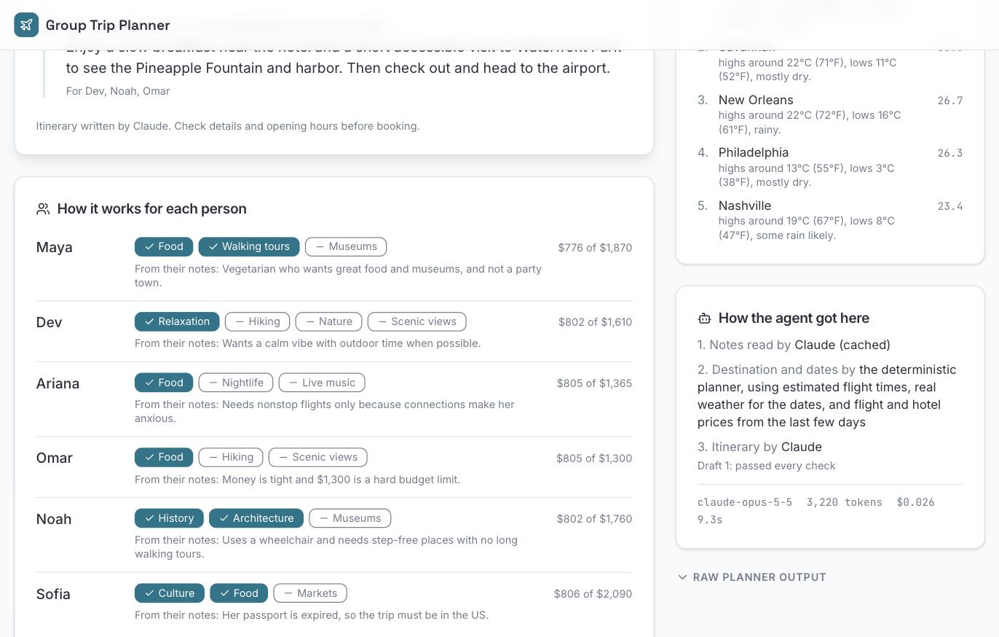
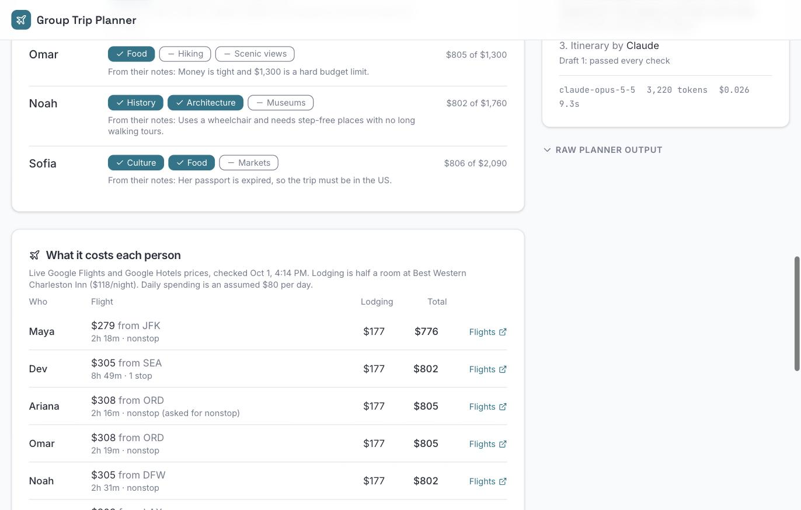

# Group Trip Planner

An agent that plans a trip for a group of friends. The organizer sends one link, everyone
answers a two-minute form on their phone, and the agent picks the dates, the destination that
works for the most people, and a day-by-day itinerary, using real weather for those dates and
live flight and hotel prices from each person's own airport. For the six-person sample group,
flying from five airports, a first plan takes 22 seconds and $0.05 of Claude calls. A
deterministic planner picks the destination and dates, Claude handles the two language tasks,
and 69 tests run without network or spend.

Live: https://grouptrip-planner.vercel.app (click "Try a sample trip" for a
group that has already answered)



## How a trip works

1. The organizer creates a trip with a rough date window and gets two links: a
   share link for friends and a private organizer link.
2. Each friend opens the share link and answers: when they are free (one or
   more date ranges), a budget and how firm it is, home city and airport,
   interests, preferred weather, longest flight they would take, passport
   status, and a free-text box for anything else (diet, accessibility,
   dealbreakers).
3. The organizer watches answers arrive and presses Plan.
4. Everyone sees the plan on the share link: destination, dates, per-person
   costs with booking links, weather, the itinerary, who each day is for, the
   runner-up, and what limited the options.

Nobody needs an account. Trips are deleted after 60 days.

## How the agent works



The planner decides, and Claude advises and writes. The destination and dates
always come from deterministic code that can be tested and explained. Claude does
the two jobs that need language.

1. Reading notes. "My passport is expired", "I use a wheelchair, nothing with
   long walks", and "not a party town" become structured constraints the planner
   enforces: domestic only, a mobility level, tags to avoid, diet, nonstop only.
   The output is restricted by schema to tags that exist in the destination data,
   so anything Claude returns is something the scorer can act on.
2. Writing the itinerary for the destination the planner chose, with each day
   naming who it is for. Every draft runs through the same must-pass checks as
   the rest of the plan (right dates, right number of days, everyone appears on
   at least one day). Failures go back to Claude as feedback in the same
   conversation, up to three drafts, and then a template takes over.

The planner itself filters on hard rules (nobody's home city, passports, each
person's own budget against their own real cost, each person's longest flight)
and scores what is left on five weighted, normalized components: how much of
each person's interest list a place covers, the least-served person's coverage
(so nobody gets nothing), climate match against real weather, budget headroom,
and penalties for crowds and dealbreakers. If the group has no overlap or no
feasible destination, it says which person or which rule is in the way and
what would fix it ("Raising Omar's budget to $1,100 would make Charleston
possible").

Every external step degrades instead of failing. Without Claude the planner
uses keyword rules and a template itinerary, without weather it uses static
climate tags, and without prices it uses estimates. The plan shows which sources
were used in a trace at the bottom of the organizer view.



## Cost and limits

Measured on the sample trip (six people, five home airports):

| | Claude cost | Price searches | Time |
|---|---|---|---|
| First plan, nothing cached | $0.05 | 7 | 22 s |
| Same group again | $0.02 to $0.03 | 0 | 9 to 14 s |

- Claude Opus 5.5 at low effort for the itinerary. Medium effort measured 35 s
  and $0.06 with no visible gain on the same plan.
- SerpApi's free plan allows 250 searches a month. The app caches every price
  for three days, stops live searches at 200 a month, and falls back to
  estimates after that. A destination is price-checked only if the quota covers
  all of its searches.
- Planning is rate-limited to 10 runs per hour per visitor.



Known limits, stated plainly.

- The 61 destinations and their tags are hand-curated, about four activity tags each, so a
  city can look worse at food than it is.
- Flight time is estimated from distance until real prices are checked, and the estimate is
  short for trips with a connection.
- Prices come from Google Flights through SerpApi and can change by the time someone books.
  The app links to the search and never books anything.

## Where it started

I first built it in the winter of 2026 for the University of Chicago AI integration program, as
a scoring script over a CSV of survey answers ([the original brief](docs/original-brief.md)).
It has since become a shareable product with Claude, live weather and live prices, and its
tests went from 0 to 69.

## Run it locally

Needs Node 22 or newer and a Postgres database (a free Neon database works).

```sh
npm install
cp .env.example .env          # or create .env with the variables below
npm run db:migrate            # create the tables
npm run dev                   # app and API at http://localhost:5173
npm test                      # 69 tests, no network, no API spend
npm run check                 # types
```

The variables are `DATABASE_URL` (pooled) and `DATABASE_URL_UNPOOLED` (used by
the migration), `ANTHROPIC_API_KEY`, `SERPAPI_API_KEY`, and optionally
`SERPAPI_MONTHLY_CAP` (default 200). The two API keys are optional. Without them
the planner falls back to keyword rules, the template itinerary, and estimated
prices.

The database tests run only when `DATABASE_URL` is set:

```sh
node --env-file=.env node_modules/.bin/vitest run tests/postgres.test.ts
```

## Deploy

The app deploys to Vercel from `main`. `npm run build:vercel` builds the React
app and bundles the whole API into a single Node function with esbuild, then
writes Vercel's Build Output format (`.vercel/output`) with explicit routes.
Set `ANTHROPIC_API_KEY` and `SERPAPI_API_KEY` in the Vercel project and connect
the Neon database, which adds `DATABASE_URL`.

## Layout

```
planner/          the deterministic planner: parsing, dates, scoring, checks, the pipeline. No I/O
server/           the API, the agent loop, storage, sample trip
server/claude/    the two Claude steps and the wrapper they share
server/data/      geocoding and travel time, weather, flight and hotel prices
client/src/       the React app: landing, new trip, friend form, organizer view
data/             61 destinations with coordinates and airports, sample groups as CSV
db/schema.sql     tables: trips, responses, cache, rate limits
scripts/          database migration, destination enrichment, Vercel build
tests/            planner, API, agent (scripted Claude), data (saved SerpApi responses)
docs/             the original brief and screenshots
```

`PRD.md` is the spec, `CLAUDE.md` the standing rules for working in the repo,
`CHANGELOG.md` the history, and `INDEX.md` one line per file.

TypeScript, React, Vite, Tailwind, Zod, Vercel Functions, Neon Postgres, Claude
API (structured outputs), Open-Meteo, SerpApi, Vitest.
