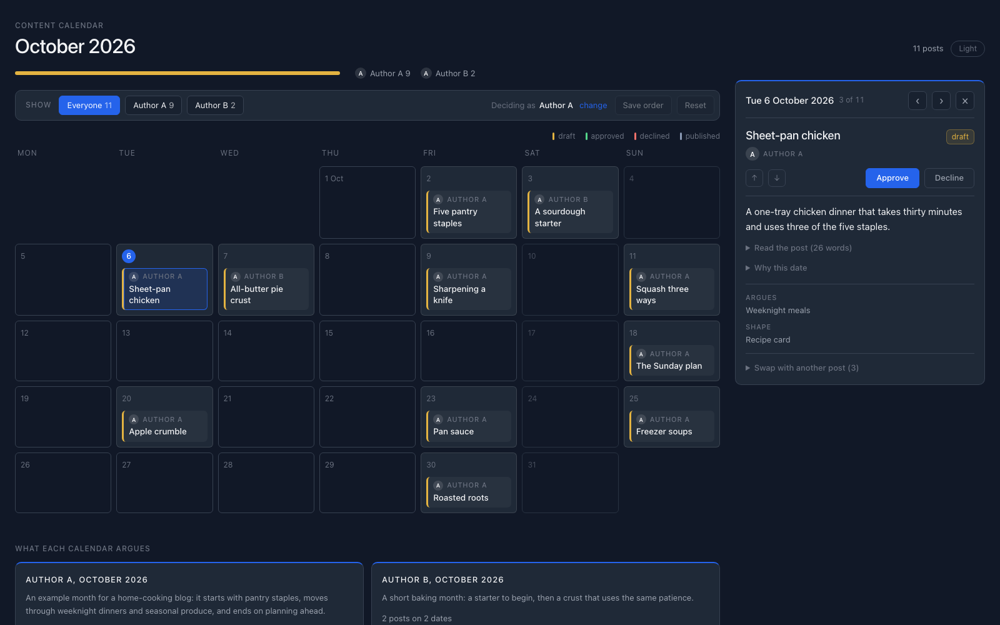

# content-calendar

Built during my internship at QofAI. A teammate started this agent and I took it over and
rebuilt it. By git blame, I wrote 98% of the code in the repo today (25,220 of 25,626 lines).
It plans a posting calendar for the company's authors. It does not write posts. It reads
finished drafts plus a weekly news scan, and decides which post goes on which day for each
author, one month at a time. Nothing is published by the
agent; a person approves every post and records when it went out.

A daily job ingests each source and flags any that go quiet or arrive late. Once a month a
single Claude Opus 5 call at high effort sequences the posts into a calendar per author,
returning schema-constrained JSON under a policy defined entirely in YAML. Before saving, every
slot's thread, form and lens tags are checked against the content taxonomy. Each calendar is
re-checked weekly and repaired on failure. Authors approve, decline, swap and reschedule on a
served page through one approval queue, and the reason required on every decline feeds the
next run. The agent never posts.

The code is not published. A sanitized copy is under review by QofAI and stays private until
QofAI approves its release. A live walkthrough is available on request.

The screenshot uses an invented home-cooking blog with two authors and invented posts.

## How it works

- Ingestion reads each upstream source every morning: a folder of finished drafts and RSS
  feeds for the market scan. Every run is logged to an append-only store, and gap detection
  raises a flag when a source goes quiet or an expected input is late.
- Synthesis builds a month's calendar with one Claude call. The whole sequencing policy
  (cadence, posting days per author, what to weigh) lives in one YAML file, and the Python
  holds no criterion of its own. A scheduled job builds next month's calendars, a weekly
  refresh asks whether a standing calendar is still the right one, and a repair step fixes a
  window that failed validation without touching one that is already standing.
- The calendar model defines the window and slot schema and validates every window against
  the thread, form and lens vocabulary before it is saved.
- The approval queue is the only thing that records a human decision. A decline needs a
  reason, which goes back to the agent for its next pass. Publishing needs an approval and a
  link to the live post.
- A Flask app serves the calendar as one page with every author's posts on it. Reviewers can
  approve, decline, undo, swap two posts, drag a post to a new date, and mark a post published.
  Every action goes through the queue and the page re-reads the store, so what it shows is what
  was saved. The same page can also be written as a static file.

## Testing

171 tests across the approval queue (18), calendar model (29), ingestion (26) and synthesis
(98), plus 28 checks on the served page.

Python, Claude API, Flask, RSS, PyYAML.
