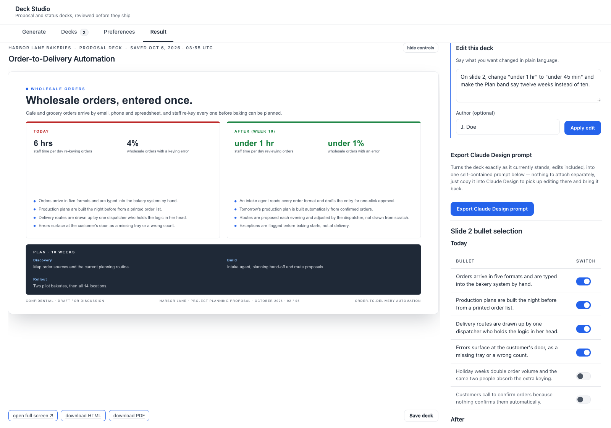
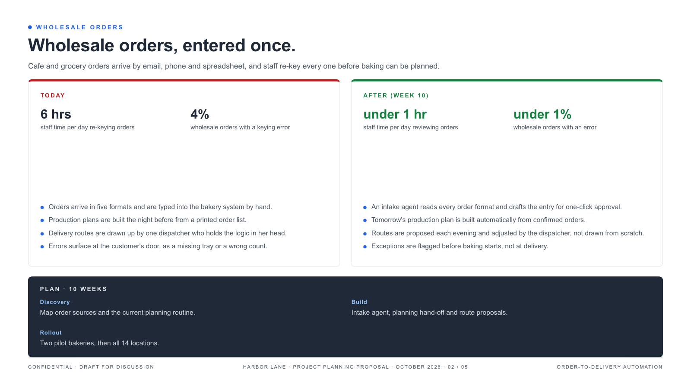
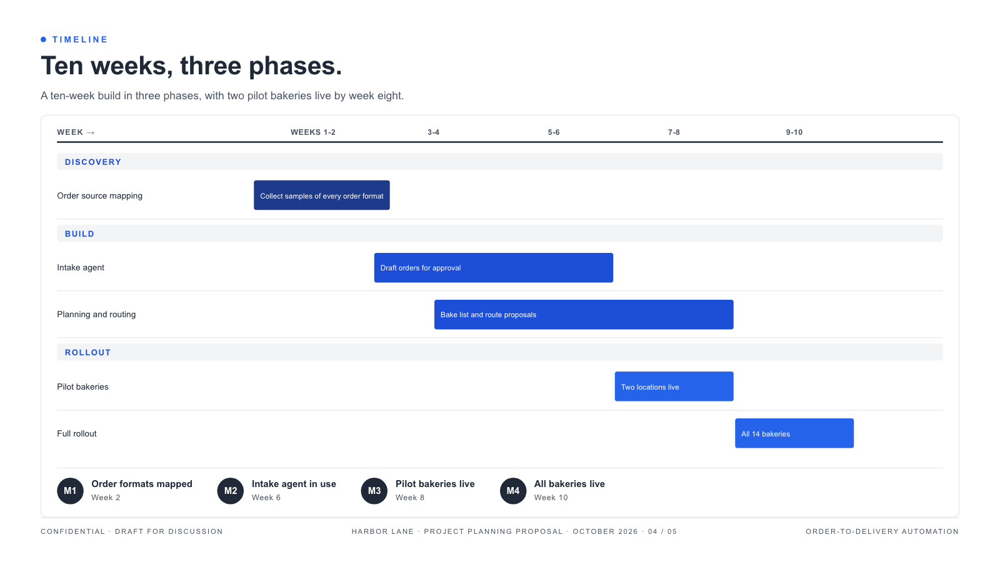
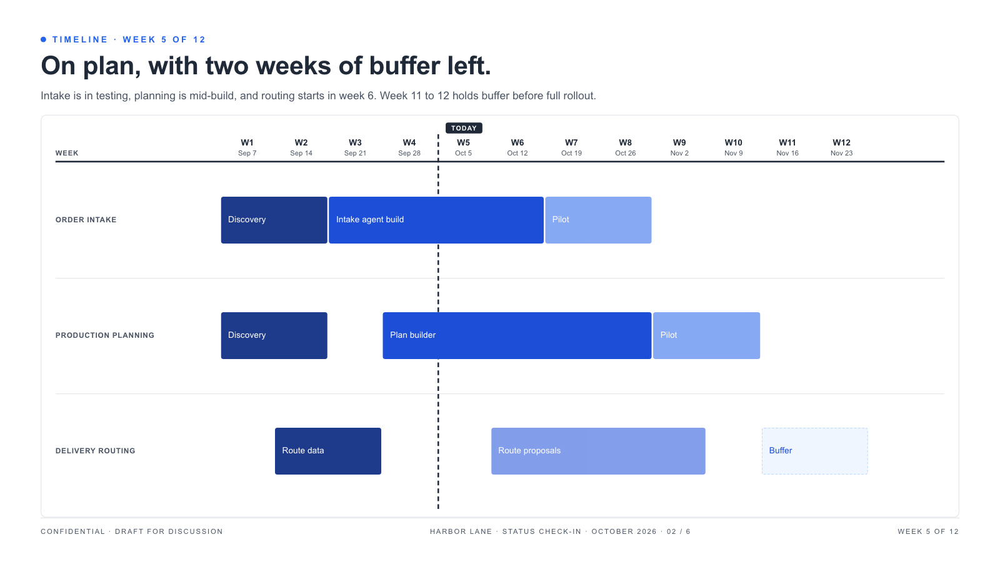
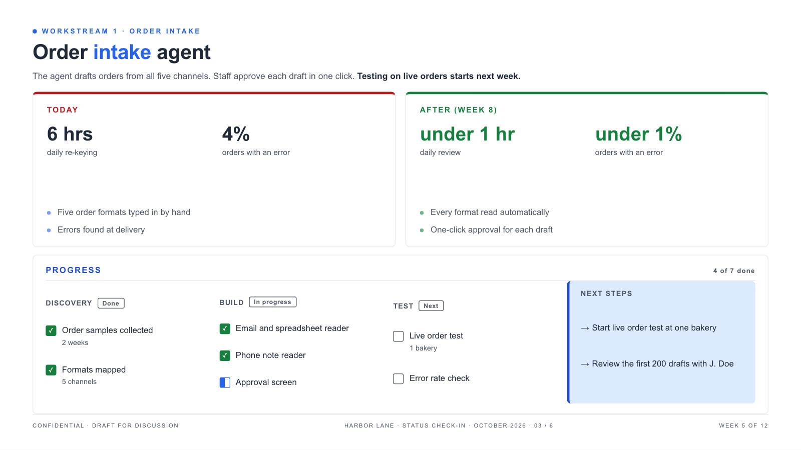

# deck-generator

Built during my internship at QofAI, and the largest thing I have built. This agent writes two
kinds of slide deck: a proposal deck before a project starts, and a status check-in deck while
it runs. A person reviews every deck before it goes anywhere. The agent never sends anything.

- 2,447 automated tests in the production repo, about 40,000 lines of test code against
  38,000 lines of application code.
- Two ways in: pick a company and its opportunities live from the company's internal project
  platform over MCP, or upload a PRD and let the agent build from the document.
- Eight deterministic guards between the model and the reviewer, built so a deck never states
  a value its sources do not support.
- Two re-runnable eval harnesses, one of which proves that a packet missing required data
  escalates to a human and writes nothing.

It generates both decks and gives reviewers a studio to finish them without touching HTML.
Built so the founders could have an in-house alternative to Claude Design. Claude Opus renders
the deck from a typed slide spec, and eight deterministic guards check it first. Every value
must be sourced or marked missing, no number or name may change during style passes, a deck
may not contradict the PRD it was built from, and nothing may clip in headless Chrome.

The review studio is the center of the project. A reviewer types an edit in plain language,
Claude Opus translates it into exact text swaps on named slides, and deterministic code
applies them, so the rest of the deck stays byte-for-byte identical and a request the model
cannot pin down changes nothing. One value typed into a missing-value card fills every place it
belongs, such as a date repeated across six footers. Reviewers can switch individual bullets on
or off and save formatting edits as standing preferences for future decks (content edits never
carry over). Every change is a logged revision with one-click undo, and decks export to PDF.

The code is not published. A sanitized copy is under review by QofAI and stays private until
QofAI approves its release. A live walkthrough is available on request.

| Proposal: comparison panels | Proposal: timeline |
|---|---|
|  |  |

| Status: project tracking | Status: workstream |
|---|---|
|  |  |

Every screenshot comes from an invented company (Harbor Lane Bakeries). The decks are real
pipeline output; the data behind them is made up.

## Where the data comes from

The reviewer chooses the source on the generate tab.

Live from the platform. A headless MCP client I wrote connects to the company's internal
project platform with a bearer key. The reviewer types a company, the studio asks the platform
for that company's published opportunities, and the reviewer picks one or more from a list. The
provider then fetches each opportunity's records and assembles them into a data packet. When the
platform cannot find the company or the key is missing, the reviewer sees the reason on the
page instead of an empty list or a server error.

From an uploaded PRD. A reviewer can attach PDF, Word or Markdown documents. Each file becomes
text or comes back with one of eight named refusals (empty, encrypted, wrong type for its
extension, an old format with the exact save-as step to fix it, and so on), because a deck
written from an empty extraction would look fine and say nothing. A Word document keeps the
heading and table structure Word recorded. A PRD describes the whole engagement, so it becomes
the base for every opportunity in the deck. When a deck carries several opportunities, each PRD
is routed to the opportunity its front matter names, so two PRDs in either order give each
opportunity its own timeline and figures. The commercial slide is read straight from the PRD's
cost and payback tables, and anything the PRD does not state is drawn as a missing value
rather than guessed.

Both paths can run together: live records for each opportunity, plus uploaded documents that
take precedence where they speak.

## What it does

A reviewer picks a deck type, a company and its opportunities, optionally attaches documents,
and the agent:

1. Loads the slide structure for the deck type from a template spec. Each slide declares typed
   content roles, who is expected to fill them (a source or a reviewer), and which roles repeat
   per opportunity or per workstream.
2. Assembles the data packet from the platform, the uploaded documents, or both.
3. Maps the packet onto the slide roles. A completeness score gates the run per opportunity: a
   thin source is marked and the deck still renders, and the run is refused only when nothing
   clears.
4. Builds one labeled prompt section per slide, then renders an HTML deck through the Claude
   API. The same content also comes out as a prompt for Claude Design, so a designer can work
   from it.
5. Runs the result through a stack of guards before a reviewer sees it.

Neither deck has a fixed slide count. A proposal repeats its opportunity slides once per
opportunity, each written only from its own sources. A status deck carries one slide per active
workstream.

## The guards

Most of the code exists to make sure a deck never states something its sources did not.

- A PRD-loyalty guard runs first and checks the rendered deck against the PRD it was built
  from, so a deck built from a ten-week PRD cannot state a different plan.
- A coverage guard checks that every role the template needs either has a sourced value or
  carries a visible `[MISSING: ...]` marker. Nothing is filled with a plausible guess.
- A render guard checks that every marker and load-bearing value in the prompt survives into
  the rendered HTML.
- A text gate applies formatting rules deterministically, then proves that no number, date,
  dollar figure, percentage or proper noun changed between input and output.
- A layout guard renders the deck in headless Chrome and flags clipped, overlapping or
  off-slide elements. A panel-fit check decides what a fixed-size panel can hold before render.
- A display-text guard fails a render when the deck's own markup reads as copy on a slide.
- A packet consistency check refuses a packet that contradicts itself.

## The review studio

A Flask app where a reviewer generates, reads and edits decks. It has tabs for generating, deck
history, standing preferences and the result. On the result tab a reviewer can switch
individual bullets on and off, ask for an edit in plain language (a model call turns it into
exact swaps that deterministic code applies, with revisions and undo), supply missing values,
and download the deck as HTML or as a PDF printed in headless Chromium. Preferences a reviewer
saves apply to later runs, but a content rule always wins over a formatting preference.

Every model call is bounded by a timeout and a token ceiling, and a failed call says so on
the page instead of producing a silently thinner deck.

## Testing and evals

2,447 tests in the production repo. Two re-runnable eval harnesses sit beside the suite: the
first checks coverage, slide count and cross-company leakage across a set of status packets,
and the second proves that a packet missing required data escalates to a human and writes no
files at all.

Python, Claude API, MCP, Flask, Playwright, SQLite.
